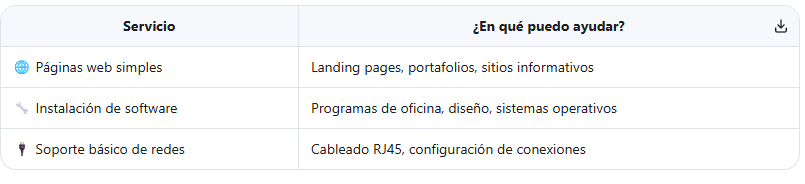

👋 Hola, soy Juan Didy Solar Ccarhuas
Estudiante de Arquitectura de Plataformas y Servicios TIC 🎓
Aprendiendo a crear soluciones web con pasión y dedicación 💻
🚀 Sobre mí
¡Hola! 👋 Soy un estudiante apasionado por el mundo de la tecnología. Estoy comenzando mi camino en el desarrollo web y cada día aprendo algo nuevo.
Lo que me gusta:

✨ Crear páginas web funcionales y bonitas
🗄️ Trabajar con bases de datos
🐍 Aprender Python y Django
🧩 Resolver problemas con código
📚 Seguir aprendiendo todos los días

💻 Lo que estoy aprendiendo

🌱 Frontend:
   • HTML5 - Estructura de páginas
   • CSS3 - Estilos y diseño responsivo
   • JavaScript - Interactividad básica

🌱 Backend:
   • Python - Lógica de programación
   • Django - Framework para web apps

🌱 Herramientas:
   • MySQL - Bases de datos
   • Docker - Contenedores (en proceso)
   • Git - Control de versiones

💡 Nota: Estoy en constante aprendizaje. ¡Cada proyecto me enseña algo nuevo!
📦 Mis Proyectos

🎯 SISGESA
Sistema de gestión para control de inventarios y ventas.
1 Tecnologías: Python • Django • MySQL • HTML/CSS

🏗 ARKIT SYSTEM
Plataforma web para gestión de proyectos.
1 Tecnologías: Django • JavaScript • CSS3

📋 Sistema de Reportes Comunitarios
Aplicación para reportar y seguir incidencias locales.
1 Tecnologías: Django • MySQL • Bootstrap
🔗 Pronto agregaré enlaces para ver las demos en vivo

🛠️ Servicios que ofrezco
Como estudiante, estoy disponible para colaborar en:

Servicio
¿En qué puedo ayudar?
🌐 Páginas web simples
Landing pages, portafolios, sitios informativos
🔧 Instalación de software
Programas de oficina, diseño, sistemas operativos
🔌 Soporte básico de redes
Cableado RJ45, configuración de conexiones
⚠️ Siempre comunico claramente lo que puedo hacer y lo que estoy aprendiendo

📚 Mi ruta de aprendizaje
✅ HTML y CSS básicos
✅ JavaScript fundamental
✅ Python desde cero
✅ Django - modelos y vistas
🔄 MySQL - consultas y relaciones
🔄 Docker - conceptos básicos
⏳ Next.js / React (próximo)
⏳ Testing y buenas prácticas

📬 ¿Hablamos?
Me encantaría conectar con otros estudiantes, mentores o personas interesadas en colaborar.
📧 Email: contactozky@gmail.com
🐙 GitHub: https://github.com/jhoyce-z
📍 Ubicación: Perú 🇵🇪

✉️ ¿Cuándo escribirme?
✅ Si tienes un proyecto pequeño para practicar
✅ Si quieres compartir recursos de aprendizaje
✅ Si buscas un compañero para un proyecto estudiantil
✅ Si tienes consejos para un desarrollador junior 🙏
🌟 Agradecimientos
A mis profesores por guiarme en este camino
A la comunidad open source por sus tutoriales y código abierto
A ti, por visitar mi perfil 💙